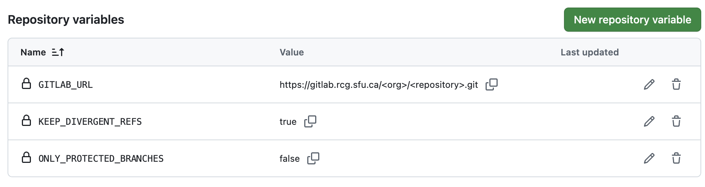
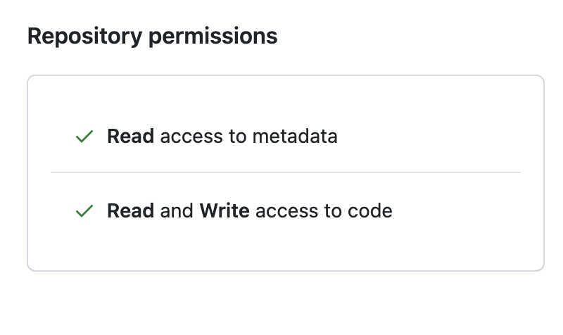
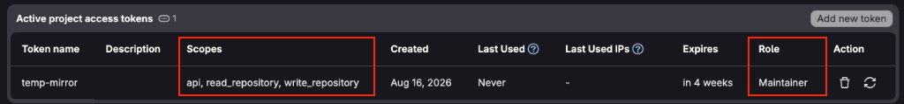
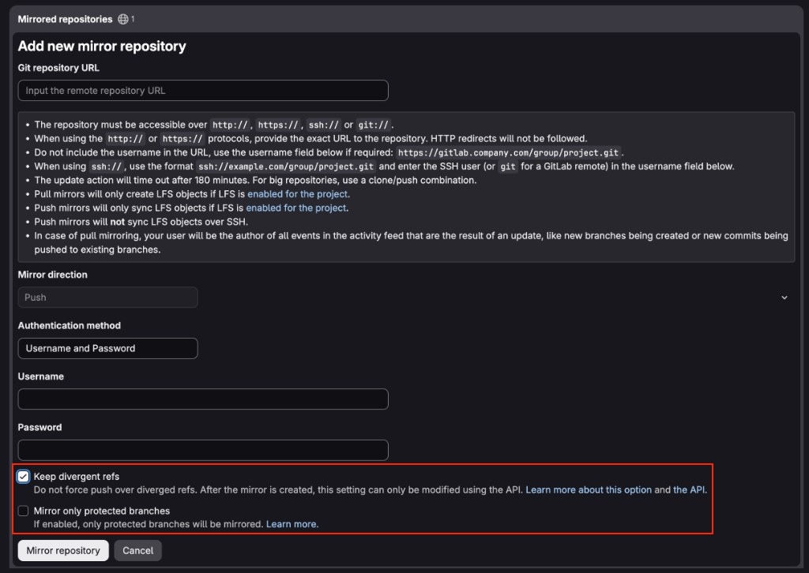

# GitHub → GitLab push-mirror Action

Reusable composite Action ([VWJF/mirroring](https://github.com/VWJF/mirroring)) that **push-mirrors a GitHub ref to GitLab**, using the same knobs and deletion rules as [GitLab push mirroring](https://docs.gitlab.com/user/project/repository/mirror/push/).

- **Standalone:** GitHub → GitLab only. GitLab’s native mirror is not required.
- **Bidirectional:** this Action plus GitLab’s native push mirror (GitLab → GitHub). Native GitLab pull/bidirectional mirroring is not used.

Callers use `uses: VWJF/mirroring@main` (or a tag/SHA). Set `GITLAB_URL` to the destination clone URL (for example `https://gitlab.rcg.sfu.ca/<user>/temp-mirror.git`). Do not hardcode a destination in the Action.

See [FAQ.md](FAQ.md) for design choices, loops, divergence, merges, recovery, and alerts.

## What is mirrored

Identical **git trees**: commits, the triggering branch or tag, and tag creates/updates.

Not mirrored: issues, pull requests / merge requests, branch protection, secrets, webhooks, or GitHub/GitLab release objects (git tags still sync). `.github/workflows` and `.gitlab-ci.yml` both exist on both remotes; each platform ignores the other’s CI files.

The Action never runs `git push --mirror`. It only updates the **event’s ref**.

This Action lives in its own repository, so `actions/checkout` of the **source** repo cannot delete `action.yml` / `scripts/` (`github.action_path` is this repo). It checks out the triggering SHA (or the default branch on delete events), not `main` on every run.

## Inputs

| Input | Required | Default | Meaning |
| --- | --- | --- | --- |
| `gitlab_url` | yes | — | HTTPS clone URL of the GitLab destination |
| `gitlab_username` | no | `oauth2` | HTTPS username (typical for a PAT) |
| `gitlab_token` | yes | — | Token with `write_repository`. For protected `main`, GitLab role **Maintainer** (Developer cannot push protected branches) |
| `github_token` | no | `github.token` | Clone GitHub if private; query branch protection |
| `only_protected_branches` | no | `true` | Skip unprotected GitHub branches (tags still sync) |
| `keep_divergent_refs` | no | `true` | Do not force-push or delete dest-only refs; fail if GitLab diverged |
| `skip_github_actors` | no | empty | Skip these GitHub usernames / `app[bot]` actors (bidirectional loop guard) |

> [!NOTE]
> This Action defaults `keep_divergent_refs` to **true** (fail closed). GitLab’s native push mirror defaults the same idea to **off** (overwrite). For a one-way GitHub → GitLab mirror that overwrites like GitLab, set this Action’s input to `false`. For bidirectional use, set **true on both sides**.

## Setup

Finish **GitHub**, then **GitLab**. You will set the same policy twice: they are independent and one side cannot change the other.

| Policy | GitHub variable | GitLab mirror checkbox |
| --- | --- | --- |
| Keep divergent refs (fail closed; **required for bidirectional**) | `KEEP_DIVERGENT_REFS=true` | **Keep divergent refs** checked |
| Overwrite destination (can **lose commits**) | `KEEP_DIVERGENT_REFS=false` | **Keep divergent refs** unchecked (GitLab’s **default**) |
| Only protected branches | `ONLY_PROTECTED_BRANCHES=true` | **Mirror only protected branches** checked |

> [!IMPORTANT]
> **Standalone** is GitHub → GitLab only (this Action). **Bidirectional** adds GitLab’s native **push** mirror (GitLab → GitHub). Do not use GitLab native pull/bidirectional mirroring. GitHub → GitLab is near-immediate. GitLab → GitHub is Sidekiq: within about five minutes, or about one minute if only protected branches are mirrored. Do not delay this Action to “match” GitLab; it compares **live GitLab** with `git ls-remote`.

> [!TIP]
> For standalone, skip every step marked **Bidirectional only**.

### GitHub

1. In the **source** GitHub repo, add a workflow that checks out that repo, then calls this Action (`uses: VWJF/mirroring@main`). See [Caller example](#caller-example).
2. Add repository **secret** `GITLAB_TOKEN`. Create the token on GitLab in the next section, then paste it here. Do not put the URL or token in the workflow file.
3. Set repository **variables** (Settings → Secrets and variables → Actions → Variables):
   - `GITLAB_URL` (required) — HTTPS clone URL, for example `https://gitlab.rcg.sfu.ca/<user>/temp-mirror.git`
   - `GITLAB_USERNAME` (optional; default `oauth2`)
   - `ONLY_PROTECTED_BRANCHES` (`true`/`false`; Action default `true`)
   - `KEEP_DIVERGENT_REFS` (`true`/`false`; Action default `true`)
   - `SKIP_GITHUB_ACTORS` — leave empty for standalone; for bidirectional, the dedicated GitHub username or `your-app[bot]` from step 5

   

> [!WARNING]
> The screenshot shows `KEEP_DIVERGENT_REFS=false` (overwrite GitLab). That can **lose commits**. For bidirectional use, set `KEEP_DIVERGENT_REFS=true`.

4. Protect the GitHub branches you want mirrored. You will match this list on GitLab. Do not rewrite mirrored history.

5. **Bidirectional only:** create a **dedicated GitHub user or GitHub App** used only as GitLab’s push-mirror credentials. Do not use a human account that also pushes real work. Issue a PAT (or App token) with **Metadata: read** and **Contents (code): read/write**. If the repo contains `.github/workflows`, also grant **Workflows: read/write**. Set `SKIP_GITHUB_ACTORS` to that username (or `your-app[bot]`).

   

> [!TIP]
> Loop safety is this skip list **and** a no-op if GitLab already has the same SHA (`git ls-remote`). You still need `SKIP_GITHUB_ACTORS` so GitLab’s push back to GitHub does not retrigger the Action in a loop.

6. **Bidirectional only:** watch this repository and enable **Actions / failed workflow** notifications if you want maintainer alerts. GitHub emails the pusher by default, not every maintainer. See [Alerts](#alerts).

### GitLab

Do this after the GitHub variables and (for bidirectional) the dedicated PAT exist.

1. Create a GitLab **project or personal access token** with role **Maintainer** and scopes `api`, `read_repository`, `write_repository`. Paste it into GitHub secret `GITLAB_TOKEN`.

   

> [!WARNING]
> **Developer** cannot push GitLab’s default protected `main` (`You are not allowed to push code to protected branches`). The token must be **allowed to push** that branch. You do **not** need to unprotect `main`. Leave “Allowed to force push” off unless `KEEP_DIVERGENT_REFS` is `false`.

2. Protect the same branches as on GitHub (including `main`). Keep the two lists in sync.

3. Use **HTTPS** for GitLab clone/mirror URLs. GitLab push mirroring does not sync LFS over SSH. Both remotes must use the same object format (SHA-1 vs SHA-256). The Action never writes a credential helper or token to the runner’s `~/.gitconfig` (GitHub-hosted and self-hosted runners).

4. **Bidirectional only:** **Settings → Repository → Mirroring repositories** → **Add new mirror repository**. Check **Keep divergent refs** before you save.

   

> [!CAUTION]
> GitLab’s default is **Keep divergent refs** **unchecked**: it **force-pushes** over diverged refs on GitHub. This Action cannot override that checkbox. After the mirror exists, the setting can only be changed via the API. If you leave the default, GitHub history can disappear even when the Action would have failed closed.

   Fill in:
   - Direction: **Push**
   - URL: `https://github.com/<owner>/<repo>.git`
   - Authentication: username and password
   - Username: the dedicated GitHub account from the GitHub section
   - Password: the GitHub PAT from the GitHub section
   - **Keep divergent refs:** checked (required for bidirectional)
   - **Mirror only protected branches:** checked if that matches `ONLY_PROTECTED_BRANCHES`

### After a divergence

If the same branch (including a merge to `main`) moved on both sides, a non-fast-forward is expected. With `keep_divergent_refs: true` the job fails and **neither history is overwritten**.

> [!WARNING]
> **Do not “fix” a failed GitHub→GitLab sync by editing `main` on GitLab.** The two tips have already diverged. GitLab’s native push mirror defaults to **overwrite** (`Keep divergent refs` off). That force-update can land on GitHub and **drop commits that only existed on GitHub** (a merge that never reached GitLab, for example). GitHub’s “Allow force pushes: off” does not always stop this if the mirror user can bypass protection (admins, or **Enforce admins** off).

Recovery (manual; the Action does not merge for you):

1. Fetch both remotes.
2. Integrate the two tips (merge or rebase) until they share one tip.
3. Push that tip to **one** remote only.
4. Let mirroring copy it to the other.
5. Close leftover PRs/MRs on the other platform. Do not merge the same feature independently on both sides.

> [!NOTE]
> Squash/rebase merges are often **not** git-ancestors of the default branch, so a deleted GitHub feature branch may be **left** on GitLab (same as GitLab’s own push mirror).

## Alerts

GitLab and GitHub do **not** notify the same people. Bidirectional operators should expect GitLab to email maintainers, and should **subscribe on GitHub** if they want the Action’s failures too.

### GitLab (native push mirror → GitHub)

When a **remote (push) mirror update fails**, GitLab:

- Shows a warning on the **project details** page (for example “Push mirroring failed … ago”) and an **Error** badge under **Settings → Repository → Mirroring repositories**. Hover the badge for the git error (auth, protected branch, divergent refs, and so on).
- Emails **project Maintainers and Owners** once per failure streak (`remote_mirror_update_failed`). A later retry does **not** send another mail until the mirror succeeds again, then fails again.

That includes **Keep divergent refs**: GitLab skips the diverged ref, marks the update **failed**, and uses the same UI + maintainer email. A different mail is sent if mirroring is **disabled because the mirror user was deleted**.

This Action cannot change GitLab’s recipients. Project emails must be enabled; Maintainers who have disabled notifications for the project will not get the mail.

### GitHub (this Action → GitLab)

GitHub has **no** mirror-failure mail to all maintainers. A red workflow is only an Actions failure:

- GitHub emails the **user who triggered** the run (the pusher), if that user has **Actions** notifications on.
- Other Maintainers / Owners are **not** emailed unless they **watch** the repository and enable notifications for **Actions** / failed workflow runs (GitHub → Settings → Notifications, and the repo’s Watch menu). Watching “Releases only” or turning Actions off means they will miss a diverged-ref failure (`keep_divergent_refs: true` exits non-zero on purpose).

To get the same “tell every maintainer” behavior as GitLab, each person must subscribe, or the caller workflow must add an extra `if: failure()` step (issue, Slack, and so on). This Action does not send that extra alert.

## Caller example

> [!NOTE]
> Do not add `on: create`. A tag push already fires `push`, so `create` runs the same job twice. `workflow_dispatch` only shows **Run workflow** in the Actions UI after this file exists on the repository **default branch**.

```yaml
name: Push mirror to GitLab
on:
  push:
  workflow_dispatch:
    inputs:
      ref:
        description: Branch or tag to mirror
        required: false
        type: string

concurrency:
  group: push-mirror-${{ github.repository }}-${{ github.event.inputs.ref || github.ref }}
  cancel-in-progress: false

jobs:
  mirror:
    runs-on: ubuntu-latest
    permissions:
      contents: read
    steps:
      - uses: actions/checkout@v5
        with:
          fetch-depth: 0
          fetch-tags: true
          lfs: true
      - uses: VWJF/mirroring@main
        with:
          gitlab_url: ${{ vars.GITLAB_URL }}
          gitlab_username: ${{ vars.GITLAB_USERNAME || 'oauth2' }}
          gitlab_token: ${{ secrets.GITLAB_TOKEN }}
          github_token: ${{ secrets.GITHUB_TOKEN }}
          only_protected_branches: ${{ vars.ONLY_PROTECTED_BRANCHES || 'true' }}
          keep_divergent_refs: ${{ vars.KEEP_DIVERGENT_REFS || 'true' }}
          skip_github_actors: ${{ vars.SKIP_GITHUB_ACTORS }}
```

> [!WARNING]
> `cancel-in-progress` must stay **false** so an in-flight `git push` is not aborted.

The first checkout is optional if you rely on this Action’s inner checkout of `github.sha`. Keeping it is fine and makes the source tree available to later steps.

## Tests

Remote tests (updates, GitLab knobs, then the other direction) are driven from your machine. The Action is not invoked locally; GitHub Actions and GitLab’s native push mirror are the systems under test. See [tests/README.md](tests/README.md) and run `./tests/run.sh`.

[VWJF/temp-mirror](https://github.com/VWJF/temp-mirror) is a sample caller. Its destination is set via `vars.GITLAB_URL` (for example `https://gitlab.rcg.sfu.ca/<user>/temp-mirror.git`).
