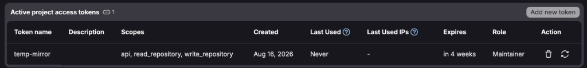
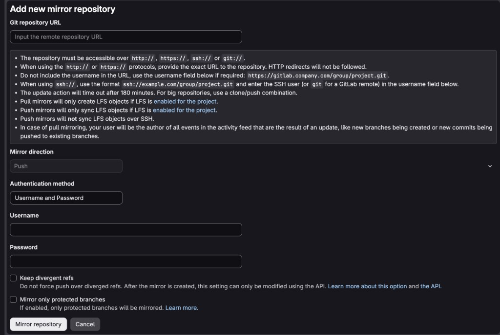

# GitHub → GitLab push-mirror Action

Reusable composite Action ([VWJF/mirroring](https://github.com/VWJF/mirroring)) that **push-mirrors a GitHub ref to GitLab**, using the same knobs and deletion rules as [GitLab push mirroring](https://docs.gitlab.com/user/project/repository/mirror/push/).

- **Standalone:** GitHub → GitLab only. GitLab’s native mirror is not required.
- **Bidirectional:** this Action plus GitLab’s native push mirror (GitLab → GitHub). Native GitLab pull/bidirectional mirroring is not used.

Callers use `uses: VWJF/mirroring@main` (or a tag/SHA). Set `GITLAB_URL` to the destination clone URL (for example `https://gitlab.rcg.sfu.ca/<user>/temp-mirror.git`). Do not hardcode a destination in the Action.

See [FAQ.md](FAQ.md) for design choices, loops, divergence, merges, recovery, and alerts.

## What is mirrored

Identical **git trees**: commits, the triggering branch or tag, and tag creates/updates.

Not mirrored: issues, pull requests / merge requests, branch protection, secrets, webhooks, or GitHub/GitLab release objects (git tags still sync). `.github/workflows` and `.gitlab-ci.yml` both exist on both remotes; each platform ignores the other’s CI files.

The Action never runs `git push --mirror`. It only updates the **event’s ref**.

This Action lives in its own repository, so `actions/checkout` of the **source** repo cannot delete `action.yml` / `scripts/` (`github.action_path` is this repo). It checks out the triggering SHA (or the default branch on delete events), not `main` on every run.

## Inputs

| Input | Required | Default | Meaning |
| --- | --- | --- | --- |
| `gitlab_url` | yes | — | HTTPS clone URL of the GitLab destination |
| `gitlab_username` | no | `oauth2` | HTTPS username (typical for a PAT) |
| `gitlab_token` | yes | — | Token with `write_repository`. For protected `main`, GitLab role **Maintainer** (Developer cannot push protected branches) |
| `github_token` | no | `github.token` | Clone GitHub if private; query branch protection |
| `only_protected_branches` | no | `true` | Skip unprotected GitHub branches (tags still sync) |
| `keep_divergent_refs` | no | `true` | Do not force-push or delete dest-only refs; fail if GitLab diverged |
| `skip_github_actors` | no | empty | Skip these GitHub usernames / `app[bot]` actors (bidirectional loop guard) |

GitLab’s native default for keep-divergent is **overwrite** (`false`). This Action defaults to `true` because bidirectional use must not clobber the other side. Set `keep_divergent_refs: false` to match GitLab’s overwrite behavior for a one-way GitHub → GitLab mirror.

## Standalone setup (GitHub → GitLab)

1. In the **source** GitHub repo, add a workflow that checks out that repo, then calls this Action (`uses: VWJF/mirroring@main`).
2. Add repository secret `GITLAB_TOKEN` (GitLab PAT / project token with `write_repository`). GitLab **protected** `main` does **not** need to be unprotected: the token must be **allowed to push** that branch. A project access token with role **Developer** is not enough — GitLab only lets **Maintainers** (or whoever is listed under Allowed to push) update protected branches. Use role **Maintainer**. Typical scopes: `api`, `read_repository`, `write_repository`. Leave “Allowed to force push” off unless `keep_divergent_refs` is `false`. Unprotecting `main` is a shortcut, not a requirement.

   

3. Set repository variable `GITLAB_URL` (HTTPS clone URL). Optionally:
   - `GITLAB_USERNAME` (default `oauth2`)
   - `ONLY_PROTECTED_BRANCHES` (`true`/`false`)
   - `KEEP_DIVERGENT_REFS` (`true`/`false`)
   - `SKIP_GITHUB_ACTORS` (leave empty for standalone)
4. Protect the branches you want mirrored on GitHub (and on GitLab if you use GitLab protection). Keep the two lists in sync.
5. Use **HTTPS** for GitLab (LFS over SSH is not supported by GitLab push mirroring). Both remotes must use the same object format (SHA-1 vs SHA-256). The Action never writes a credential helper or token to the runner’s `~/.gitconfig` (same behavior on GitHub-hosted and self-hosted runners).

## Bidirectional setup

GitHub → GitLab is this Action (near-immediate). GitLab → GitHub is GitLab’s native push mirror (Sidekiq: within ~5 minutes, or ~1 minute if only protected branches). Do not delay this Action to “match” GitLab; it compares **live GitLab** with `git ls-remote`.

1. Complete standalone setup above.
2. Create a **dedicated GitHub user or GitHub App** used only as GitLab’s push-mirror credentials. Do not use a human account that also pushes real work.
3. On GitLab: **Settings → Repository → Mirroring repositories**
   - Direction: **Push**
   - URL: `https://github.com/<owner>/<repo>.git`
   - Username: the dedicated GitHub account
   - Password: a GitHub PAT with **Metadata: read** and **Contents (code): read/write**. If the repo contains `.github/workflows`, also grant **Workflows: read/write**.

     

   - Enable **Keep divergent refs** (GitLab’s default is **off** = overwrite GitHub; this Action cannot override that)
   - Enable **Only mirror protected branches** if that matches the Action
4. Set GitHub Actions variable `SKIP_GITHUB_ACTORS` to that dedicated username (or `your-app[bot]`).
5. Set `KEEP_DIVERGENT_REFS` to `true` on the Action (default) **and** on GitLab. They are independent: the Action never changes GitLab’s mirror setting.
6. Protect `main` (and any other mirrored targets) on **both** remotes. Do not rewrite mirrored history.

### Match GitHub variables to the GitLab mirror

The GitHub Actions **repository variables** and GitLab **Add new mirror repository** checkboxes are **independent**. They must be set to the same policy, or one side will overwrite the other.

| Policy | GitHub variable | GitLab mirror checkbox |
| --- | --- | --- |
| Keep divergent refs (fail closed; **required for bidirectional**) | `KEEP_DIVERGENT_REFS=true` | **Keep divergent refs** checked |
| Overwrite destination (can **lose commits**) | `KEEP_DIVERGENT_REFS=false` | **Keep divergent refs** unchecked (GitLab’s **default**) |
| Only protected branches | `ONLY_PROTECTED_BRANCHES=true` | **Mirror only protected branches** checked |

GitLab’s default is **not** to keep divergent refs: it **force-pushes** over diverged refs on GitHub. After the mirror exists, that checkbox can only be changed via the API. This Action’s default is the opposite (`keep_divergent_refs: true`). If you leave GitLab at default, GitHub history can disappear even when the Action would have failed closed.

The screenshots below show the **dangerous** pairing (both overwrite): GitHub `KEEP_DIVERGENT_REFS=false` and GitLab **Keep divergent refs** unchecked. For bidirectional use, set **both** to keep divergent refs (`true` / checked).




Loop safety is both:

- skip pushes whose `github.actor` is in `skip_github_actors`
- no-op if GitLab already has the same SHA

### After a divergence

If the same branch (including a merge to `main`) moved on both sides, a non-fast-forward is expected. With `keep_divergent_refs: true` the job fails and **neither history is overwritten**.

**Do not “fix” a failed GitHub→GitLab sync by editing `main` on GitLab.** The two tips have already diverged. GitLab’s native push mirror defaults to **overwrite** (`keep_divergent_refs` off). That force-update can land on GitHub and **drop commits that only existed on GitHub** (a merge that never reached GitLab, for example). GitHub’s “Allow force pushes: off” does not always stop this if the mirror user can bypass protection (admins, or enforce-admins off).

Recovery (manual; the Action does not merge for you):

1. Fetch both remotes.
2. Integrate the two tips (merge or rebase) until they share one tip.
3. Push that tip to **one** remote only.
4. Let mirroring copy it to the other.
5. Close leftover PRs/MRs on the other platform. Do not merge the same feature independently on both sides.

Squash/rebase merges are often **not** git-ancestors of the default branch, so a deleted GitHub feature branch may be **left** on GitLab (same as GitLab’s own push mirror).

## Alerts

GitLab and GitHub do **not** notify the same people. Bidirectional operators should expect GitLab to email maintainers, and should **subscribe on GitHub** if they want the Action’s failures too.

### GitLab (native push mirror → GitHub)

When a **remote (push) mirror update fails**, GitLab:

- Shows a warning on the **project details** page (for example “Push mirroring failed … ago”) and an **Error** badge under **Settings → Repository → Mirroring repositories**. Hover the badge for the git error (auth, protected branch, divergent refs, and so on).
- Emails **project Maintainers and Owners** once per failure streak (`remote_mirror_update_failed`). A later retry does **not** send another mail until the mirror succeeds again, then fails again.

That includes **Keep divergent refs**: GitLab skips the diverged ref, marks the update **failed**, and uses the same UI + maintainer email. A different mail is sent if mirroring is **disabled because the mirror user was deleted**.

This Action cannot change GitLab’s recipients. Project emails must be enabled; Maintainers who have disabled notifications for the project will not get the mail.

### GitHub (this Action → GitLab)

GitHub has **no** mirror-failure mail to all maintainers. A red workflow is only an Actions failure:

- GitHub emails the **user who triggered** the run (the pusher), if that user has **Actions** notifications on.
- Other Maintainers / Owners are **not** emailed unless they **watch** the repository and enable notifications for **Actions** / failed workflow runs (GitHub → Settings → Notifications, and the repo’s Watch menu). Watching “Releases only” or turning Actions off means they will miss a diverged-ref failure (`keep_divergent_refs: true` exits non-zero on purpose).

To get the same “tell every maintainer” behavior as GitLab, each person must subscribe, or the caller workflow must add an extra `if: failure()` step (issue, Slack, and so on). This Action does not send that extra alert.

## Caller example

Do not add `on: create`. A tag push already fires `push`, so `create` runs the same job twice.

`workflow_dispatch` only shows **Run workflow** in the Actions UI after this file exists on the repository **default branch**.

```yaml
name: Push mirror to GitLab
on:
  push:
  workflow_dispatch:
    inputs:
      ref:
        description: Branch or tag to mirror
        required: false
        type: string

concurrency:
  group: push-mirror-${{ github.repository }}-${{ github.event.inputs.ref || github.ref }}
  cancel-in-progress: false

jobs:
  mirror:
    runs-on: ubuntu-latest
    permissions:
      contents: read
    steps:
      - uses: actions/checkout@v5
        with:
          fetch-depth: 0
          fetch-tags: true
          lfs: true
      - uses: VWJF/mirroring@main
        with:
          gitlab_url: ${{ vars.GITLAB_URL }}
          gitlab_username: ${{ vars.GITLAB_USERNAME || 'oauth2' }}
          gitlab_token: ${{ secrets.GITLAB_TOKEN }}
          github_token: ${{ secrets.GITHUB_TOKEN }}
          only_protected_branches: ${{ vars.ONLY_PROTECTED_BRANCHES || 'true' }}
          keep_divergent_refs: ${{ vars.KEEP_DIVERGENT_REFS || 'true' }}
          skip_github_actors: ${{ vars.SKIP_GITHUB_ACTORS }}
```

`cancel-in-progress` must stay **false** so an in-flight `git push` is not aborted.

The first checkout is optional if you rely on this Action’s inner checkout of `github.sha`. Keeping it is fine and makes the source tree available to later steps.

## Tests

Remote tests (updates, GitLab knobs, then the other direction) are driven from your machine. The Action is not invoked locally; GitHub Actions and GitLab’s native push mirror are the systems under test. See [tests/README.md](tests/README.md) and run `./tests/run.sh`.

[VWJF/temp-mirror](https://github.com/VWJF/temp-mirror) is a sample caller. Its destination is set via `vars.GITLAB_URL` (for example `https://gitlab.rcg.sfu.ca/<user>/temp-mirror.git`).
