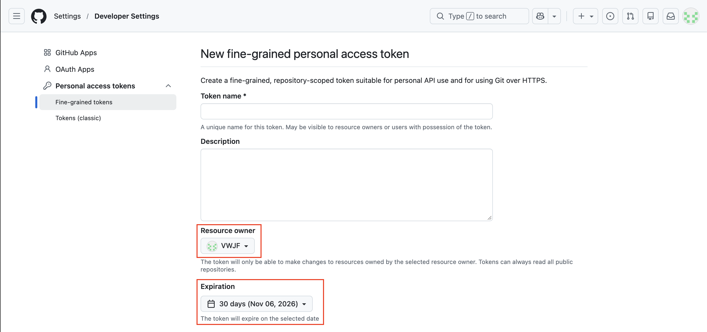
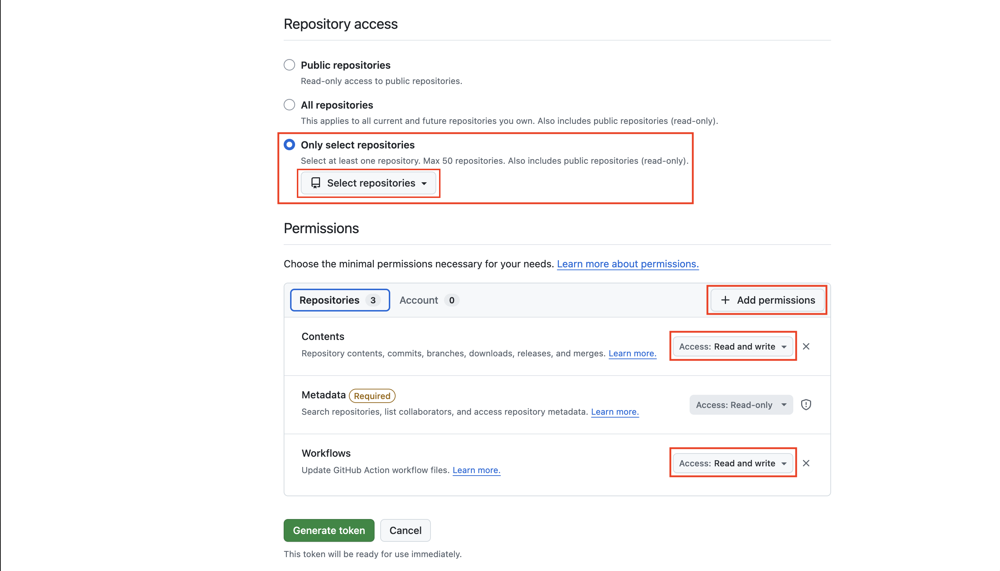
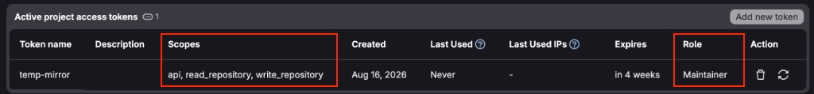
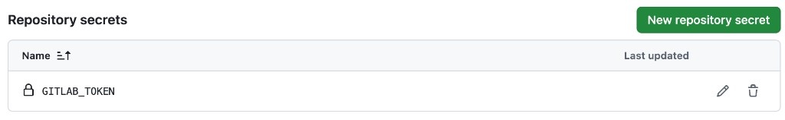
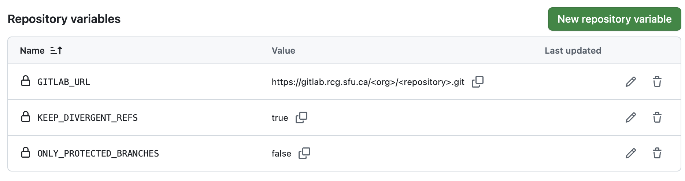
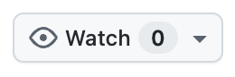
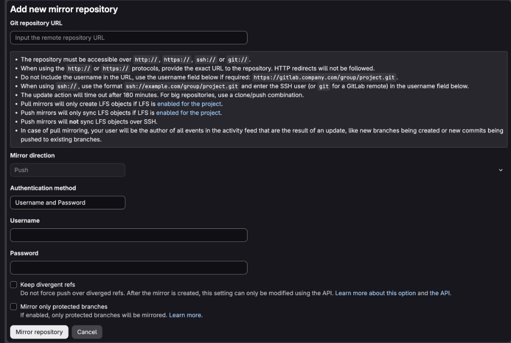

# GitHub → GitLab push-mirror Action

Reusable Action ([VWJF/mirroring](https://github.com/VWJF/mirroring)) that **push-mirrors a GitHub ref to GitLab**, using the same options and deletion rules as [GitLab push mirroring](https://docs.gitlab.com/user/project/repository/mirror/push/). Depending on the configuration of the target repo, it can be used in two modes:

- **Standalone:** GitHub → GitLab only. GitLab’s native mirror is not required.
- **Bidirectional:** this Action combined with GitLab’s native push mirror (GitLab → GitHub). Native GitLab pull/bidirectional mirroring is not used.

> [!WARNING]
> **This copies git data to another server.** Each successful run sends commits, trees, and the triggering ref from GitHub to GitLab (and, if you enable GitLab’s native push mirror, the other way too). After that copy exists, it is **not** protected only by the source host’s access control, retention, residency, or terms anymore.
>
> Typical mismatches: **private ↔ public**, **self-hosted ↔ cloud** (for example self-hosted GitLab → public GitHub, or GitHub Enterprise → public GitLab), and different organizational policies on each side. One-way mirroring does not keep the data “inside” the original space.
>
> **You** must confirm the destination is allowed to hold this history (including secrets accidentally committed). **Due care is yours.** The authors of this Action are **not responsible or liable** for its use or for data that leaves the source. Each job also prints this as an Actions **warning**. See [FAQ — Data movement, privacy, and liability](FAQ.md#does-mirroring-keep-the-sources-security-and-privacy-guarantees).

A working example is in [Caller example](#caller-example). 

Pin a **release tag**, not `@main`. Take the latest tag from [Releases](https://github.com/VWJF/mirroring/releases) (including pre-releases such as `0.0.5-alpha` until a stable `v1` exists):

```yaml
uses: VWJF/mirroring@0.0.5-alpha   # replace with the current release tag
```

A commit SHA still works for bisect. Self-hosted runners must have Docker installed for the step pushing to GitLab.

Set `GITLAB_URL` to the destination clone URL (for example `https://gitlab.rcg.sfu.ca/<user>/<repository>.git`). Do not hardcode a destination in the Action.

See [FAQ.md](FAQ.md) for data-movement / liability, design choices, loops, divergence, merges, recovery, alerts, whether steps run on the runner or in Docker, and how this differs from other solutions [SvanBoxel/gitlab-mirror-and-ci-action](https://github.com/SvanBoxel/gitlab-mirror-and-ci-action) and [pixta-dev/repository-mirroring-action](https://github.com/pixta-dev/repository-mirroring-action).

## What is mirrored

Identical **git trees**: commits, the triggering branch or tag, and tag creates/updates.

Not mirrored: issues, pull requests / merge requests, branch protection, secrets, webhooks, or GitHub/GitLab release objects (git tags still sync). `.github/workflows` and `.gitlab-ci.yml` both exist on both remotes; each platform ignores the other’s CI files.

The Action never runs `git push --mirror`. It only updates the **event’s ref**.

## Actions Inputs

| Input | Required | Default | Meaning |
| --- | --- | --- | --- |
| `gitlab_url` | yes | — | HTTPS clone URL of the GitLab destination |
| `gitlab_username` | no | `oauth2` | HTTPS username (typical for a PAT) |
| `gitlab_token` | yes | — | Token with `write_repository`. For protected `main`, GitLab role **Maintainer** (Developer cannot push protected branches) |
| `github_token` | no | `github.token` | Clone GitHub if private; query branch protection |
| `only_protected_branches` | no | `true` | Skip unprotected GitHub branches (tags still sync) |
| `keep_divergent_refs` | no | `true` | Do not force-push or delete dest-only refs; fail if GitLab diverged |
| `skip_github_actors` | no | empty | Skip these GitHub usernames / `app[bot]` actors (bidirectional loop guard) |

> [!NOTE]
> This Action defaults `keep_divergent_refs` to **true** (fail closed). GitLab’s native push mirror defaults the same idea to **off** (overwrite). For a one-way GitHub → GitLab mirror that overwrites like GitLab, set this varibale's value to `false`. For safe bidirectional use, set **true on both sides**.

## Setup

Create **credentials** first, then **configure GitHub Actions** (optionally **configure the GitLab repository**), then **configure GitLab push mirroring**. You will set the same policy twice: they are independent and one side cannot change the other.

> [!CAUTION]
> Enabling this workflow (and GitLab’s native push mirror, if you use it) **moves git history between systems**. Treat destination visibility, token scope, and “who can clone the other remote” as a governance decision, not only a sync setting. The Action will warn on every run; that warning does not replace your review.

| Policy | GitHub variable | GitLab mirror checkbox |
| --- | --- | --- |
| Keep divergent refs (fail closed; **required for bidirectional**) | `KEEP_DIVERGENT_REFS=true` | **Keep divergent refs** checked |
| Overwrite destination (can **lose commits**) | `KEEP_DIVERGENT_REFS=false` | **Keep divergent refs** unchecked (GitLab’s **default**) |
| Only protected branches | `ONLY_PROTECTED_BRANCHES=true` | **Mirror only protected branches** checked |

> [!IMPORTANT]
> **Standalone** is GitHub → GitLab only (this Action). **Bidirectional** adds GitLab’s native **push** mirror (GitLab → GitHub). GitHub → GitLab is near-immediate. GitLab → GitHub is Sidekiq: within about five minutes, or about one minute if only protected branches are mirrored. Do not delay this Action to “match” GitLab; it compares **live GitLab** with `git ls-remote`.

> [!TIP]
> For standalone, skip [Configure GitLab push mirroring](#configure-gitlab-push-mirroring) which sets up the GitLab’s native push mirror.

### Credentials

#### GitHub credentials

1. Create a dedicated GitHub user (or GitHub App) used only as GitLab’s push-mirror credentials. Using a human account that also pushes real work is discouraged.

   On that account, create a [fine-grained personal access token](https://github.com/settings/personal-access-tokens/new) (Settings → Developer settings → Personal access tokens → Fine-grained tokens). Name the token, choose the **resource owner** that owns the GitHub repo, and set an expiration.

   

   Under **Repository access**, choose **Only select repositories** and pick the GitHub repositories this token will apply to.

   Under **Permissions**, grant:

   * **Metadata: Read-only** (required).
   * **Contents: Read and write**.
   * **Workflows: Read and write** if those repos contain `.github/workflows`.

   Generate the token and paste it into GitLab’s mirroring credentials.

   

#### GitLab credentials

1. Create a GitLab **project or personal access token** with role **Maintainer** and scopes `api`, `read_repository`, `write_repository` (Settings → Access Tokens). Paste it into GitHub secret `GITLAB_TOKEN`.

   

> [!WARNING]
> **Developer** cannot push to GitLab’s default protected `main`. The token must be allowed to push branches that need syncing. You do **not** need to unprotect `main`. Leave “Allowed to force push” off unless `KEEP_DIVERGENT_REFS` is `false`.

### Configure GitHub Actions

1. In the **source** GitHub repo, add a workflow that checks out that repo, then calls this Action with the latest tag from [Releases](https://github.com/VWJF/mirroring/releases) (`uses: VWJF/mirroring@<tag>`). See [Caller example](#caller-example).
2. Add repository **secret** `GITLAB_TOKEN` (Settings → Secrets and variables → Actions → Secrets). Paste the GitLab token from [GitLab credentials](#gitlab-credentials).

   

3. Set repository **variables** (Settings → Secrets and variables → Actions → Variables):
   - `GITLAB_URL` (required) — HTTPS clone URL, for example `https://gitlab.rcg.sfu.ca/<user>/<repository>.git` (do not add the URL or token directly in the workflow file).
   - `GITLAB_USERNAME` (optional; default `oauth2`)
   - `ONLY_PROTECTED_BRANCHES` (`true`/`false`; Action default `true`)
   - `KEEP_DIVERGENT_REFS` (`true`/`false`; Action default `true`)
   - `SKIP_GITHUB_ACTORS` — leave empty for standalone; for bidirectional, the dedicated GitHub username or `your-app[bot]` from [GitHub credentials](#github-credentials)

   

> [!NOTE]
> The screenshot shows `KEEP_DIVERGENT_REFS=true`. That is the Action **default** and the **safer** choice: do not overwrite GitLab if the ref has diverged. Set `false` only if you want GitLab overwritten (can lose commits). For bidirectional use, keep `true`.

4. Protect the GitHub branches you want mirrored (_\<repo>_ -> Settings -> Branches -> Add rule). You will match this list on GitLab. The branches protection rules add another layer of safety against rewriting mirrored history.

> [!TIP]
> Loop safety is this skip list **and** a no-op if GitLab already has the same SHA (`git ls-remote`). You still need `SKIP_GITHUB_ACTORS` (e.g. `your-app[bot]`) so GitLab’s push back to GitHub does not retrigger the Action in a loop.

5. Watch this repository and enable **Actions / failed workflow** notifications if you want maintainer alerts. GitHub emails the pusher by default, not every maintainer. See [Alerts](#alerts).

   

#### Configure the GitLab repository

These are project settings, not strictly required for the mirroring.

1. **Settings → Repository → Branch defaults** — use the same default branch as GitHub (merged-branch delete uses GitLab’s default).
2. **Settings → Repository → Branch rules** — protect the same branches as on GitHub (including `main`). Keep the two lists in sync.
3. **Settings → Repository → Protected branches → Add Protected Branch**

### Configure GitLab push mirroring

Do this after the GitHub variables and the dedicated PAT exist.

**Settings → Repository → Mirroring repositories** → **Add new mirror repository**. Check **Keep divergent refs** before you save.

   

> [!CAUTION]
> GitLab’s default is **Keep divergent refs** **unchecked**: it **force-pushes** over diverged refs on GitHub. This Action cannot override that checkbox. After the mirror is configured in GitLab, the setting can only be changed by recreating the mirror config (or via the API). If you leave it unchecked (the default), then GitLab may force overwrite GitHub history and you may loose commits.

   Fill in:
   - Direction: **Push**
   - URL: `https://github.com/<owner>/<repo>.git`
   - Authentication: username and password
   - Username: the dedicated GitHub account from [GitHub credentials](#github-credentials)
   - Password: the GitHub PAT from [GitHub credentials](#github-credentials)
   - **Keep divergent refs:** checked (required for bidirectional)
   - **Mirror only protected branches:** checked if that matches `ONLY_PROTECTED_BRANCHES`

> [!NOTE]
> Use **HTTPS** for GitLab clone/mirror URLs. GitLab push mirroring does not sync LFS over SSH. Both remotes must use the same object format (SHA-1 vs SHA-256). The Action never writes a credential helper or token to the runner’s `~/.gitconfig` (GitHub-hosted and self-hosted runners).

### After a divergence

If the same branch (including a merge to `main`) moved on both sides, a non-fast-forward is expected. With `keep_divergent_refs: true` the job fails and **neither history is overwritten**.

> [!WARNING]
> **Do not “fix” a failed GitHub→GitLab sync by editing `main` on GitLab.** The two tips have already diverged. GitLab’s native push mirror defaults to **overwrite** (`Keep divergent refs` off). That force-update can land on GitHub and **drop commits that only existed on GitHub** (a merge that never reached GitLab, for example). GitHub’s “Allow force pushes: off” does not always stop this if the mirror user can bypass protection (admins, or **Enforce admins** off).

Recovery (manual; the Action does not merge for you):

1. Fetch both remotes.
2. Integrate the two tips (merge or rebase) until they share one tip.
3. Push that tip to **one** remote only.
4. Let mirroring copy it to the other.
5. Close leftover PRs/MRs on the other platform. Do not merge the same feature independently on both sides.

> [!NOTE]
> Squash/rebase merges are often **not** git-ancestors of the default branch, so a deleted GitHub feature branch may be **left** on GitLab (same as GitLab’s own push mirror).

## Alerts

GitLab and GitHub do **not** notify the same people. Bidirectional operators should expect GitLab to email maintainers, and should **subscribe on GitHub** if they want the Action’s failures too.

### GitLab (native push mirror → GitHub)

When a **remote (push) mirror update fails**, GitLab:

- Shows a warning on the **project details** page (for example “Push mirroring failed … ago”) and an **Error** badge under **Settings → Repository → Mirroring repositories**. Hover the badge for the git error (auth, protected branch, divergent refs, and so on).
- Emails **project Maintainers and Owners** once per failure streak (`remote_mirror_update_failed`). A later retry does **not** send another mail until the mirror succeeds again, then fails again.

That includes **Keep divergent refs**: GitLab skips the diverged ref, marks the update **failed**, and uses the same UI + maintainer email. A different mail is sent if mirroring is **disabled because the mirror user was deleted**.

This Action cannot change GitLab’s recipients. Project emails must be enabled; Maintainers who have disabled notifications for the project will not get the mail.

### GitHub (this Action → GitLab)

GitHub has **no** mirror-failure mail to all maintainers. A red workflow is only an Actions failure:

- GitHub emails the **user who triggered** the run (the pusher), if that user has **Actions** notifications on.
- Other Maintainers / Owners are **not** emailed unless they **watch** the repository and enable notifications for **Actions** / failed workflow runs (GitHub → Settings → Notifications, and the repo’s Watch menu). Watching “Releases only” or turning Actions off means they will miss a diverged-ref failure (`keep_divergent_refs: true` exits non-zero on purpose).

To get the same “tell every maintainer” behavior as GitLab, each person must subscribe, or the caller workflow must add an extra `if: failure()` step (issue, Slack, and so on). This Action does not send that extra alert.

## Caller example

> [!NOTE]
> Do not add `on: create`. A tag push already fires `push`, so `create` runs the same job twice. `workflow_dispatch` only shows **Run workflow** in the Actions UI after this file exists on the repository **default branch**.

```yaml
# .github/workflows/push-mirror.yml

name: Push mirror to GitLab
on:
  push:
  workflow_dispatch:
    inputs:
      ref:
        description: Branch or tag to mirror
        required: false
        type: string

concurrency:
  group: push-mirror-${{ github.repository }}-${{ github.event.inputs.ref || github.ref }}
  cancel-in-progress: false

jobs:
  mirror:
    runs-on: ubuntu-latest
    permissions:
      contents: read
    steps:
      - uses: actions/checkout@v5
        with:
          fetch-depth: 0
          fetch-tags: true
          lfs: true
      - uses: VWJF/mirroring@0.0.5-alpha  # latest tag: https://github.com/VWJF/mirroring/releases
        with:
          gitlab_url: ${{ vars.GITLAB_URL }}
          gitlab_username: ${{ vars.GITLAB_USERNAME || 'oauth2' }}
          gitlab_token: ${{ secrets.GITLAB_TOKEN }}
          github_token: ${{ secrets.GITHUB_TOKEN }}
          only_protected_branches: ${{ vars.ONLY_PROTECTED_BRANCHES || 'true' }}
          keep_divergent_refs: ${{ vars.KEEP_DIVERGENT_REFS || 'true' }}
          skip_github_actors: ${{ vars.SKIP_GITHUB_ACTORS }}
```

> [!WARNING]
> `cancel-in-progress` must stay **false** so an in-flight `git push` is not aborted.

The first checkout is optional if you rely on this Action’s inner checkout of `github.sha`. Keeping it is fine and makes the source tree available to later steps.

## Publishing a release

The GHCR image must exist **before** callers can use a docker-pinned Action. Do not retag an existing release. Bump is for **any** version (stable or pre-release); a `-` in the version (for example `-alpha`) only means you should pass `--prerelease` when you create the GitHub Release.

1. **Publish image** ([`.github/workflows/publish.yml`](.github/workflows/publish.yml)) — Actions → **Publish image** → Run workflow on this branch → `version` (for example `0.0.3-alpha`). Wait until it is green. This pushes `ghcr.io/vwjf/mirroring:0.0.3-alpha` and `v0.0.3-alpha`. It does **not** create a git tag or change `action.yml`.
2. **Bump image** ([`.github/workflows/bump-image.yml`](.github/workflows/bump-image.yml)) — Actions → **Bump image** → the **same** `version`. This **retags** the existing `uses: docker://ghcr.io/vwjf/mirroring:<old>` pin in root `action.yml` to that version and commits that file on the branch you ran on (`chore: pin mirror image to <version>`). It no-ops if the pin is already that tag, and fails if GHCR has no such image (run Publish first) or if `action.yml` has no `docker://` pin (it does not convert a bash or docker-build step). It does **not** create a git tag or GitHub Release.
3. **You** tag and create the GitHub Release (pre-release when the version contains `-`, e.g. `*-alpha`):

```bash
git pull
git tag -a 0.0.3-alpha -m "0.0.3-alpha"
git push origin 0.0.3-alpha
gh release create 0.0.3-alpha --title 0.0.3-alpha --notes "Pins the composite Action to docker://ghcr.io/vwjf/mirroring:0.0.3-alpha." --prerelease
```

Omit `--prerelease` for a stable `x.y.z`. Callers then pin `uses: VWJF/mirroring@0.0.3-alpha`.

From the CLI (needed until these workflows exist on the default branch):

```bash
gh workflow run publish.yml --ref dockerize -f version=0.0.3-alpha
# wait until Publish image is green
gh workflow run bump-image.yml --ref dockerize -f version=0.0.3-alpha
# wait until Bump image is green (action.yml committed), then tag + gh release create as above
```

Pushing a matching git tag still runs Publish image. Prefer dispatch so the image exists before you tag the Action.

## Tests

Remote tests (updates, GitLab options, then the other direction) are driven from your machine. The Action is not invoked locally; GitHub Actions and GitLab’s native push mirror are the systems under test. See [tests/README.md](tests/README.md) and run `./tests/run.sh`.

[VWJF/temp-mirror](https://github.com/VWJF/temp-mirror) is a sample caller. Its destination is set via `vars.GITLAB_URL` (for example `https://gitlab.rcg.sfu.ca/<user>/<repository>.git`).
